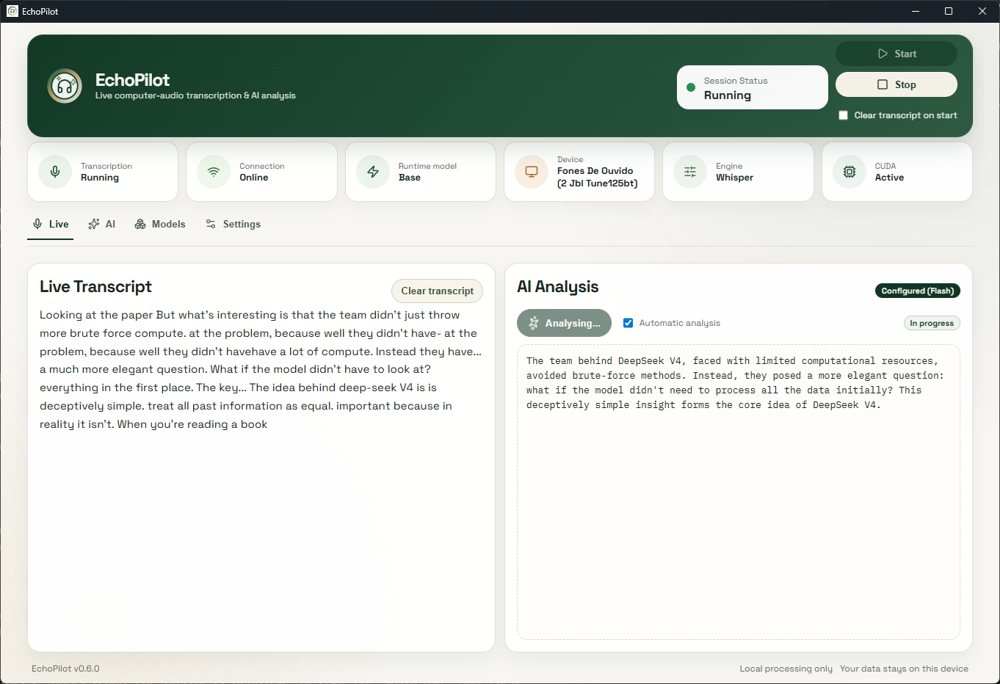

# EchoPilot

EchoPilot is a local-first Windows copilot for meetings.

The name is a play on **echo + copilot**: it captures what is being said, transcribes it in real time, and uses AI to help the user expand reasoning during conversations, especially when it is hard to clearly understand speech, remember details, or reference earlier points.

The project combines real-time system audio transcription (WASAPI loopback), DeepSeek-only LLM analysis, and dual UI delivery (web + desktop with Always On Top and PiP).

## Screenshot


## Stack
- Core service: Python + FastAPI + faster-whisper (CTranslate2)
- Web app: React + Vite + TypeScript
- Desktop: Tauri 2
- Secrets: Windows Credential Manager

## Features in this MVP scaffold
- Start/Stop transcription pipeline API.
- WASAPI loopback capture integration path.
- ASR backend with CUDA/CPU fallback status.
- WebSocket streaming for transcript/status events.
- DeepSeek LLM analysis endpoint using base URL + model + prompt.
- Web UI focused on live transcription, AI analysis, and model/runtime controls.
- Desktop wrapper with Always On Top and PiP toggles.
- Windows scripts for setup, run, and build.

## Quick Start (Windows)
1. Run the development setup once:
```powershell
./scripts/setup-dev.ps1
```
2. Start the full local app from the repository root:
```bat
run-project.bat
```
This starts the core service, the Vite web app, and the Tauri desktop shell through `scripts/run-local.ps1`.
Desktop-only window controls such as `Always on top` and `Hide from screen capture` are available only in the Tauri desktop shell started by `run-project.bat`. If you open `http://127.0.0.1:5173` directly in a regular browser, the page cannot control browser always-on-top behavior or exclude that browser window from screen capture.

3. If you prefer PowerShell, you can start the same local stack directly:
```powershell
./scripts/run-local.ps1
```

4. The web UI is available at:
- [http://127.0.0.1:5173](http://127.0.0.1:5173)

5. To stop all local EchoPilot processes:
```bat
scripts\stop-local.bat
```

Screen capture hiding uses Windows window display affinity. It can hide the controlled desktop window from supported screenshots, recordings, and screen sharing tools, but it is not a guarantee against every capture method or external camera.

## Core API
- `GET /health`
- `GET /diagnostics`
- `GET /settings`
- `PUT /settings`
- `POST /llm/credentials`
- `DELETE /llm/credentials`
- `POST /transcription/start`
- `POST /transcription/stop`
- `POST /analysis/now`
- `GET /transcript`
- `WS /ws`

## Distribution Targets
- MSI installer via Tauri bundling.
- Portable ZIP assembled from desktop build + bundled core runtime.

See [distribution guide](./docs/distribution.md).
